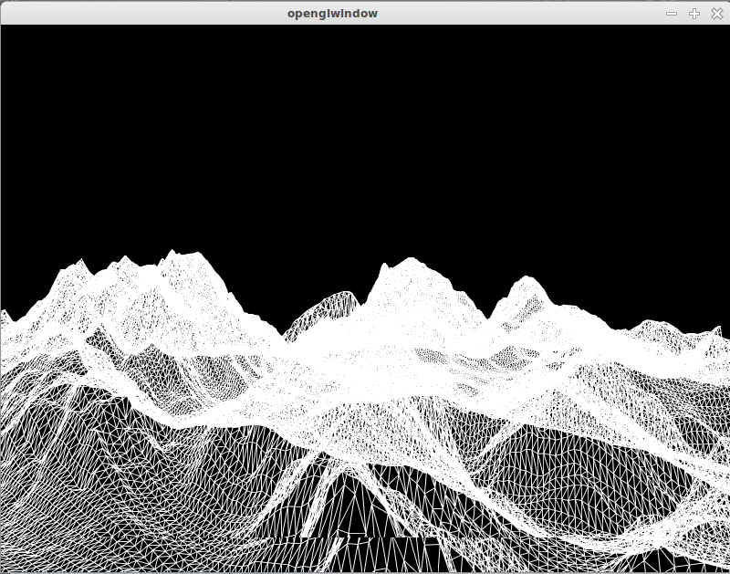

*Thibaut Castanié - M2 IMAGINA - Moteur de Jeux*

# Compte rendu du TP1

## Fonctionnalités

Mon programme permet de générer une grille composée de triangles, de la taille voulue par l'utilisateur. Il permet aussi de prendre une image *heightmap* en paramètre afin de donner du relief à la grille générée. Cela permet de visualiser une structure 3D à partir d'une image dont chaque niveau de gris correspond à une hauteur spécifique.

## Démarche de développement

Dans un premier temps, j'ai cherché à modéliser la grille à la main, en partant sur une structure comportant 3x3 points.

	//Dessine un carré 3x3 avec des triangles, avec 11 coordonnées
    GLfloat vertices[] = {
        0.0f, 0.0f, 0.0f,
        0.0f, 0.2f, 0.0f,
        0.2f, 0.0f, 0.0f,
        0.2f, 0.2f, 0.0f,
        0.4f, 0.0f, 0.0f,
        0.4f, 0.2f, 0.0f,
        0.4f, 0.4f, 0.0f,
        0.2f, 0.2f, 0.0f,
        0.2f, 0.4f, 0.0f,
        0.0f, 0.2f, 0.0f,
        0.0f, 0.4f, 0.0f
    };

Ensuite, j'ai pu coder l'algorithme permettant d'obtenir le même résultat avec une taille de X par Y.

Pour lire une *heightmap*, j'ai utilisé la fonction *qGray(p)* couplée avec *pixel(x,y)* de *QImage*, qui retourne la valeur en niveau de gris d'un pixel donné. J'ai ensuite multiplié cette valeur et je l'ai appliqué sur l'axe des Z (la hauteur).

J'ai apporté quelques modifications à la caméra de base pour avoir une vue optimale de la scène.

## Structures de données

- une taille de grille **X** et **Y**
- un tableau **points[]** de flottants contenant les coordonnées des points de la grille
- un tableau **couleurs** stockant les couleurs des sommets
- une image **relief** de type *QImage* contenant la *heightmap*

## Screenshot

